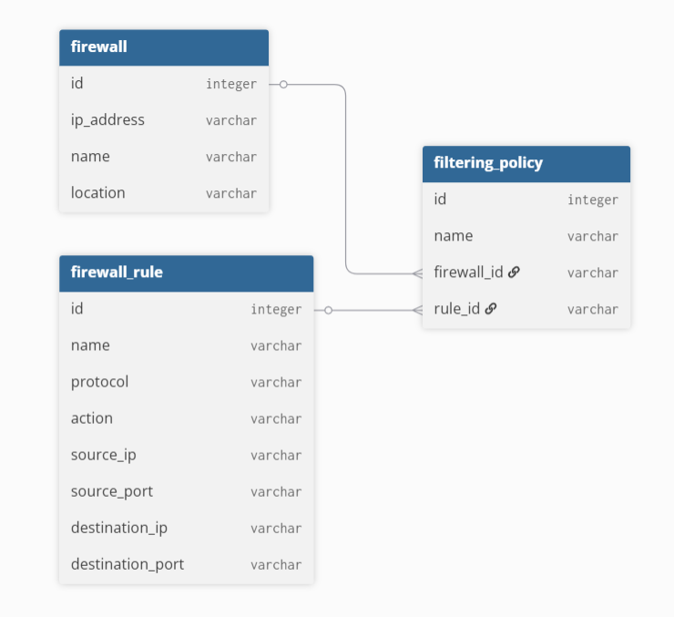
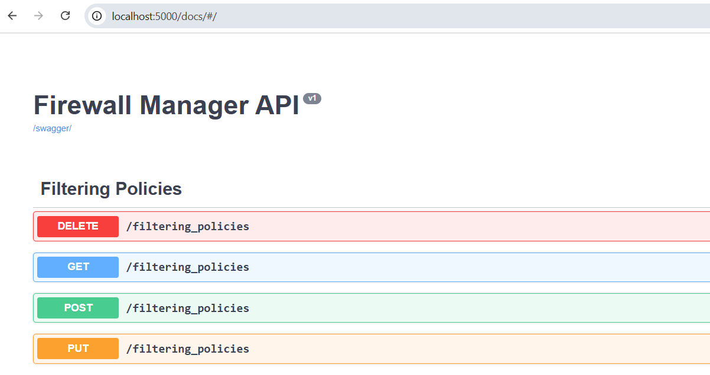

# Firewall Manager API

This repository contains an implementation of a Flask API server, 
that allows to perform CRUD operations on: 

- firewalls
- firewall rules
- filtering policies

Schema and relationship between elements mentioned is described on the following diagram:



## Installation

### Docker

1. In the root directory of the project, build the image:

```bash
docker build -t firewall-manager .
```

2. Launch the container:

```bash
docker run -p 5000:5000 firewall-manager
```

### Locally

1. Create and activate a dedicated python environment:

```bash
python3 -m venv ~/.venv/firewall_manager
source ~/.venv/firewall_manager/bin/activate
```

2. Install the dependencies:
    
```bash
pip install -r src/requirements.txt
```

3. Start the application:

```bash
flask run
```

## Testing

To allow easy testing of the API, Swagger is hosted on /docs endpoint.



Default body values provided in Swagger can be used to populate the database before making other types 
of requests.
