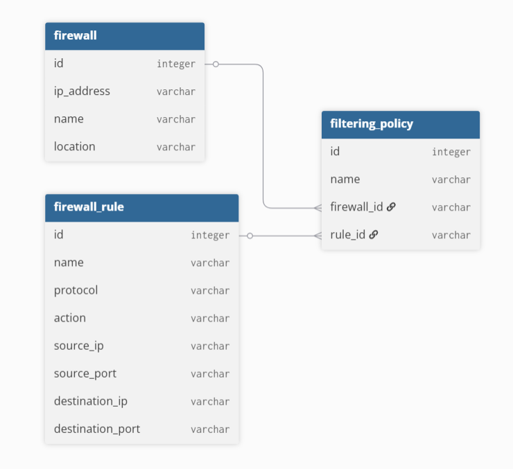
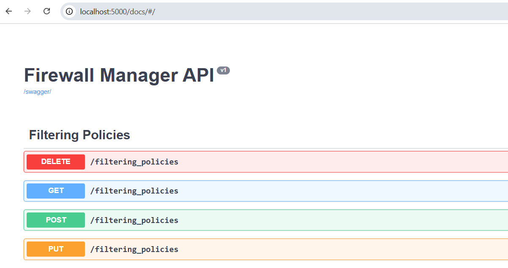

# Firewall Manager API

This repository contains an implementation of a Flask API server, 
that allows to perform CRUD operations on: 

- firewalls
- firewall rules
- filtering policies

Schema and relationship between elements mentioned is described on the following diagram:



## Installation

### Docker

1. In the root directory of the project, build the image:

```bash
docker build -t firewall-manager .
```

2. Launch the container:

```bash
docker run -p 5000:5000 firewall-manager
```

### Locally

1. Create and activate a dedicated python environment:

```bash
python3 -m venv .venv
source .venv/bin/activate
```

2. Install the dependencies:
    
```bash
pip install -r requirements.txt
```

3. Start the application:

```bash
flask run
```

## Testing

After starting the API Server, Swagger homepage can be found on http://localhost:5000/docs endpoint.



_Please note that default body values provided in Swagger are an example of valid request formatting
and can be used to populate the database._

1. Create a firewall

First, create a firewall, either using the Swagger POST request on /firewall endpoint, or by executing:

```bash
curl -X POST "http://localhost:5000/firewalls" -H "accept: application/json" -H "Content-Type: application/json" -d "{ \"ip_address\": \"192.168.1.1\", \"location\": \"Office-1\", \"name\": \"test-firewall\"}"
```

2. Create a firewall rule

Similarly, create a firewall rule:

```bash
curl -X POST "http://localhost:5000/firewall_rules" -H "accept: application/json" -H "Content-Type: application/json" -d "{ \"action\": \"Allow\", \"destination_ip\": \"192.168.1.3\", \"destination_port\": \"3000\", \"name\": \"test-firewall\", \"protocol\": \"tcp\", \"source_ip\": \"192.168.1.2\", \"source_port\": \"5000\"}"
```

3. Create a filtering policy

Lastly, create a filtering policy that references the ids of previously created firewall and firewall rule:

```bash
curl -X POST "http://localhost:5000/filtering_policies" -H "accept: application/json" -H "Content-Type: application/json" -d "{ \"firewall_id\": \"1\", \"name\": \"test-policy\", \"rule_id\": \"1\"}"```
```

4. Test the API

With the database populated after steps 1-3, it is now possible to fully test the API, performing 
all types of requests provided.